<p align="center">
  
</p>


# Sambodhan: AI-Powered Grievance Redressal System for Local Governance
[](LICENSE)
[](https://fastapi.tiangolo.com/)
[](https://www.python.org/)
[](https://nextjs.org/)
[](https://www.typescriptlang.org/)
[](https://www.postgresql.org/)
[](https://www.docker.com/)
[](https://huggingface.co/xlm-roberta-base)
[](https://groq.com/)

<p align="center">
  <b>Streamline citizen complaints, automate classification, and empower local governance with AI.</b><br>
</p>

## Overview

Sambodhan is a full-stack AI-powered platform for citizen grievance management in local governance. It enables multi-channel complaint submission, automated classification (department & urgency), real-time analytics, and continuous model improvement. Built with Next.js (frontend), FastAPI (backend), and state-of-the-art NLP models, Sambodhan is designed for scalability, transparency, and actionable insights.

---

##  Project Demo

https://github.com/user-attachments/assets/9a10a840-c52a-4b78-9fbf-ebb1a6e2def0

---

### Table of Contents

- [Features](#features)
- [System Architecture](#system-architecture)
- [Quickstart](#quick-start)
- [Repository Structure](#repository-structure)
- [Grievance Dataset Schema](#grievance-dataset-schema)
- [Model Overview](#model-overview)
  - [System Architecture](#system-architecture)
  - [Department Classification Model](#1-department-classification-model)
  - [Urgency Classification Model](#2-urgency-classification-model)
- [Continuous Learning System for Sambodhan AI](#continuous-learning-system-for-sambodhan-ai)
- [Frontend Features](#frontend-features)
- [Backend Features](#backend-features)
- [Analytics & Admin Dashboard](#analytics--admin-dashboard)
- [Chatbot System](#chatbot-system)
- [API Client Usage](#api-client-usage)
- [Testing](#testing)
- [Contributing](#contributing)

---

## Features

- 🌐 **Multi-channel Grievance Submission:** Web & mobile support for easy complaint filing.
- 🤖 **AI-Powered Department Classification:** Automated routing using advanced NLP models.
- ⚡ **Urgency & Sentiment Detection:** Instantly assess complaint priority and tone.
- 💬 **Integrated AI Chatbot:** Conversational support for citizens, FAQs, and guided grievance submission.
- 📊 **Real-Time Analytics Dashboard:** Interactive insights for citizens & admins.
- 🛠️ **Admin Dashboard:** Track, manage, and resolve grievances efficiently.
- 🔒 **Secure Authentication:** JWT-based, context-aware user access.
- 🧩 **RESTful API:** Robust FastAPI backend for seamless integration.
- 🔄 **Continuous Learning:** Automated retraining & dataset preparation for smarter models.
- 🐳 **Dockerized Deployment:** Effortless setup for frontend, backend, and orchestrator.
- 🔁 **CI/CD Automation:** Streamlined workflows with GitHub Actions.
- 🧱 **Modular Codebase:** Built with Next.js, FastAPI, Hugging Face, PyTorch for scalability.
---

## System Architecture

```mermaid
flowchart LR

%% ============================
%% USERS
%% ============================
Citizen["👤 Citizen User"]
Admin["🛂 Admin User"]

%% ============================
%% FRONTEND
%% ============================
subgraph WebApp["🌐 Frontend (Next.js)"]
      ComplaintForm["📝 Grievance Submission Form"]
      ChatbotWidget["💬 AI Chatbot Widget"]
      Dashboard["📊 Citizen/Admin Dashboard"]
      Charts["📈 Analytics Visualizations"]
      AuthClient["🔐 JWT Authentication"]
end

%% ============================
%% API GATEWAY
%% ============================
subgraph Gateway["🛣️ API Gateway (FastAPI)"]
    Router["🔀 Request Router"]
end

%% ============================
%% MICROSERVICES
%% ============================
subgraph ComplaintsMS["📮 Complaints Service"]
    ComplaintsAPI["📝 Complaints API"]
end

subgraph LocationMS["🗺️ Location Service"]
    LocationAPI["📍 Location API"]
end

subgraph AnalyticsMS["📊 Analytics Service"]
    AnalyticsAPI["📈 Analytics API"]
end

subgraph ChatbotMS["🤖 Chatbot Service"]
    ChatbotAPI["💬 Chatbot API"]
end

subgraph AuthMS["🔐 Auth Service"]
    AuthAPI["🔑 JWT Issuer & Validator"]
end

%% ============================
%% AI / ML MICROSERVICES
%% ============================
subgraph NLPServices["🧠 AI / ML Microservices"]
    DeptClassifier["🏛️ Department Classifier (XLM-RoBERTa)"]
    UrgencyClassifier["⏱️ Urgency Classifier"]
    RAGChatbot["🧩 RAG Chatbot (Groq Llama-3.3-70B)"]
end

%% ============================
%% DATABASE & STORAGE
%% ============================
subgraph Storage["🗄️ Data & Storage"]
    PostgreSQL["🛢️ PostgreSQL Database"]
    Datasets["📂 Analytics Datasets"]
end

%% ============================
%% ORCHESTRATION / MLOPS
%% ============================
subgraph Orchestrator["⚙️ MLOps Orchestrator"]
    AutoRetrain["🔁 Auto Model Retraining"]
    WorkflowEngine["📦 Workflow Engine"]
end

%% ============================
%% USER FLOWS
%% ============================
Citizen --> ComplaintForm --> Router
Citizen --> ChatbotWidget --> Router
Citizen --> Dashboard --> Router
Citizen --> Charts --> Router
Admin --> Dashboard --> Router
Admin --> Charts --> Router
AuthClient --> Router

%% ============================
%% ROUTING TO MICROSERVICES
%% ============================
Router --> ComplaintsAPI
Router --> ChatbotAPI
Router --> AnalyticsAPI
Router --> LocationAPI
Router --> AuthAPI

%% ============================
%% COMPLAINTS SERVICE → AI → DB
%% ============================
ComplaintsAPI --> DeptClassifier
ComplaintsAPI --> UrgencyClassifier

DeptClassifier --> PostgreSQL
UrgencyClassifier --> PostgreSQL

%% ============================
%% OTHER SERVICES → STORAGE
%% ============================
LocationAPI --> PostgreSQL
AnalyticsAPI --> Datasets
ChatbotAPI --> RAGChatbot

%% ============================
%% AI SERVICE CONNECTIONS
%% ============================
RAGChatbot --> DeptClassifier
RAGChatbot --> UrgencyClassifier

%% ============================
%% ORCHESTRATION FLOWS
%% ============================
WorkflowEngine --> AutoRetrain
AutoRetrain --> DeptClassifier
AutoRetrain --> UrgencyClassifier

```



---

## 🚀 Quick Start

### Prerequisites
- **Docker Desktop** (recommended for quick setup)
- **Node.js 18+** and **Python 3.11+** (for local development)
- **Git**

---

### Installation & Running (Docker Recommended)

```bash
# 1. Clone the repository
git clone <repository-url>
cd Sambodhan-AI-Powered-Grievance-Redressal-System-for-Local-Governance

# 2. Set up environment variables
cp src/backend/.env.example src/backend/.env
cp frontend-next/.env.example frontend-next/.env
# Edit both .env files with your configuration (API keys, secrets, DB URL, etc.)

# 3. Start all services
docker compose up -d --build

# 4. Verify services are running
docker compose ps
```

---

### Access the Application

- **Frontend:** [http://localhost:3000](http://localhost:3000)
- **Backend API:** [http://localhost:8000](http://localhost:8000)
- **Interactive API Docs:** [http://localhost:8000/docs](http://localhost:8000/docs)
- **Alternative API Docs:** [http://localhost:8000/redoc](http://localhost:8000/redoc)
- **Database Admin (if enabled):** [http://localhost:8080](http://localhost:8080)

---

<details>
  <summary>🖥️ Local Development Setup (Optional)</summary>

#### Backend (FastAPI)
```bash
python -m venv env
source env/bin/activate  # On Windows: .\env\Scripts\activate
pip install -r requirements.txt
cp src/backend/.env.example src/backend/.env
# Edit src/backend/.env as needed
cd src/backend/app
uvicorn main:app --reload
```

#### Frontend (Next.js)
```bash
cd frontend-next
npm install
cp .env.example .env
# Edit frontend-next/.env as needed
npm run dev
```
</details>

---

## Repository Structure

```
├── docs/                     # Project documentation
│   ├── architecture.md       # System architecture, components and high-level diagrams
│   ├── department_classifier.md # Department classifier API, deployment and customization guide
│   ├── grievance_dataset_schema.md # Grievance dataset schema, labels and mappings
│   ├── prepare_dataset.md    # Prepare-dataset HF Space: pipeline, deployment and usage
│   ├── README.md             # Docs index (this file summarizes and links the other docs)
│   ├── retraining_classifier.md # Retraining pipeline architecture, decision gates and runbook
│   └── urgency_classifier.md # Urgency classifier API, deployment and examples
├── data/                     # All project data
│   ├── raw/                  # Original/raw datasets
│   │   ├── csv/              # CSV data files
│   │   └── sql/              # SQL dumps
│   ├── processed/            # Cleaned / preprocessed data
│   └── external/             # External or third-party datasets
├── notebooks/                # Jupyter notebooks for exploration & experimentation
├── orchestrator/             # All CI/CD orchestration logic
│   ├── orchestrator.py       # Main orchestrator script
│   ├── .env_examples         # Example environment variables file
│   ├── requirements.txt      # Orchestrator-specific dependencies
│   └── __init__.py           # makes it a Python package
├── src/                      # Source code
│   ├── __init__.py
│   ├── backend/              # Core backend application
│   │   ├── app/              # FastAPI app entrypoint & routers
│   │   ├── models/           # Database / ORM models
│   │   ├── database/         # DB connections and migrations
│   │   └── utils/            # Backend utility functions
│   ├── frontend/             # Frontend application (Next.js / React)
│   │   ├── components/       # UI components
│   │   ├── pages/            # Frontend pages/routes
│   │   └── assets/           # Static assets (images, css, js)
│   ├── data_science/         # ML/NLP pipelines and experiments
│   │   ├── preprocessing/    # Data cleaning and feature engineering
│   │   ├── models/           # Training scripts / model definitions
│   │   ├── evaluation/       # Model evaluation metrics & plots
│   │   └── utils/            # ML utility functions
│   └── services/             # Standalone classifier microservices
│       ├── department_classifier_api/  # Department classification API
│       ├── prepare_dataset # prepare dataset pipeline
│       ├── retrain_model # retrain model pipeline
│       └── urgency_classifier_api/     # Urgency classification API
├── tests/                    # Automated tests
│   ├── backend/              # Backend tests
│   ├── frontend/             # Frontend tests
│   └── data_science/         # ML/NLP pipeline tests
├── scripts/                  # Utility scripts for automation
│   └── export/               # Scripts to export or preprocess data
├── requirements.txt          # Python dependencies
├── environment.yml           # Conda environment specification
├── Dockerfile                # Dockerfile for main backend
├── docker-compose.yml        # Docker compose setup for multiple services
├── .gitignore                # Git ignore rules
└── README.md                 # Project overview

```

## Grievance Dataset Schema

| Column Name   | Data Type      | Description                                                                                             | Example / Allowed Values                                                                                                                                                                   |
| ------------- | -------------- | ------------------------------------------------------------------------------------------------------- | ------------------------------------------------------------------------------------------------------------------------------------------------------------------------------------------ |
| **id**        | Integer/String | Unique identifier for each grievance record.                                                            | 1001                                                                                                                                                                                       |
| **grievance** | String         | Text of the citizen grievance describing the issue.                                                     | "Street lights not working in Ward 5."                                                                                                                                                     |
| **dept**      | String         | The department or super-department responsible for addressing the grievance.                            | Allowed values:<br>- Municipal Governance & Community Services<br>- Education, Health & Social Welfare <br>- Infrastructure, Utilities & Natural Resources<br>- Security & Law Enforcement |
| **urgency**   | String         | The urgency category of the grievance, based on predefined labels: `normal`, `urgent`, `highly urgent`. | "urgent"                                                                                                                                                                                   |

> Detail Dataset Report: [Grievance Dataset Schema](docs/grievance_dataset_schema.md)

---

## Model Overview

### System Architecture

- **Frontend:** Next.js (React, TypeScript)
- **Backend:** FastAPI (Python, RESTful API)
- **ML Models:** Transformer-based text classification (`xlm-roberta-base`)
- **Frameworks:** Hugging Face Transformers, PyTorch
- **Deployment:** Docker, Hugging Face Spaces, GitHub Actions
- **Database:** PostgreSQL (for feedback, analytics, retraining)
- **Core Features:** Batch inference, confidence scoring, automated text preprocessing

---

### 1. Department Classification Model

A production-ready transformer model that classifies citizen grievances into appropriate municipal departments. Deployed as a containerized FastAPI service on Hugging Face Spaces.

#### Resources

| Resource             | Link                                                                                                | Description                                |
| -------------------- | --------------------------------------------------------------------------------------------------- | ------------------------------------------ |
| **Model Repository** | [sambodhan_department_classifier](https://huggingface.co/sambodhan/sambodhan_department_classifier) | Pre-trained weights and configuration      |
| **Live API**         | [Swagger UI](https://sambodhan-department-classifier.hf.space/docs)                                 | Interactive API documentation              |
| **Documentation**    | [Department Classifier Docs](docs/department_classifier.md)                                         | Deployment, usage, and customization guide |

#### Quick Start

```bash
curl -X POST "https://sambodhan-department-classifier.hf.space/predict" \
  -H "Content-Type: application/json" \
  -d '{"text": "Where can I get a new water connection?"}'
```
<details>
  
<summary>Model Evaluation</summary>

  **Classification Report**
  
  
  **Confusion Matrix**
  
</details>
---

### 2. Urgency Classification Model

A transformer-based classifier that determines the urgency level of citizen grievances. Deployed as a containerized FastAPI service on Hugging Face Spaces.

#### Resources

| Resource             | Link                                                                                          | Description                                |
| -------------------- | --------------------------------------------------------------------------------------------- | ------------------------------------------ |
| **Model Repository** | [sambodhan_urgency_classifier](https://huggingface.co/sambodhan/sambodhan_urgency_classifier) | Pre-trained weights and configuration      |
| **Live API**         | [Swagger UI](https://sambodhan-urgency-classifier-space.hf.space/docs)                        | Interactive API documentation              |
| **Documentation**    | [Urgency Classifier Docs](docs/urgency_classifier.md)                                         | Deployment, usage, and customization guide |

#### Quick Start

```bash
curl -X POST "https://sambodhan-urgency-classifier.hf.space/predict_urgency" \
  -H "Content-Type: application/json" \
  -d '{"text": "The water supply in my area has been cut off for 3 days."}'
```
<details>
  <summary>Model Performance</summary> 

  **Classification Report**
  
  
  **Confusion Matrix**
  

</details>


---

## Continuous Learning System for Sambodhan AI

Sambodhan’s **Continuous Learning System** orchestrates automated dataset preparation and model retraining, ensuring its **Urgency** and **Department** classification models continuously learn from real-world feedback with minimal manual intervention.

This system consists of three core components:

1. **Dataset Preparation Pipeline**
2. **Model Retraining Pipeline**
3. **Orchestrator: Continuous Learning CI/CD**

This system leverages **Hugging Face Spaces**, **GitHub Actions CI/CD**, **PostgreSQL**, and **Weights & Biases** for a fully traceable, resource-efficient, and performance-driven pipeline.

---

### Workflow


> Fig: Continuous Learning Workflow


---

### 1. Dataset Preparation Pipeline

The **Dataset Preparation Pipeline** automatically gathers, cleans, and publishes new training data for retraining cycles.

#### Key Highlights

- **Event-driven execution** – triggered whenever the **Prepare Dataset Space** restarts (manual or API).
- **Database integration** – fetches **misclassified grievances** and balances them with correctly predicted samples.
- **Data preprocessing** – handles cleaning, encoding, and dataset splitting.
- **Version control** – pushes versioned datasets to the **Hugging Face Dataset Hub** with timestamped tags.
- **Experiment tracking** – logs dataset statistics and push status in **W&B**.
- **Resource-efficient** – the Space auto-pauses after completion to conserve compute.
- **Notify User** - Send Run Summary Email to Admin

<details>
  <summary>Components</summary> 

| Component                 | Role                                            |
| ------------------------- | ----------------------------------------------- |
| **Prepare Dataset Space** | Automates data collection and preprocessing     |
| **PostgreSQL Database**   | Stores grievances and feedback samples          |
| **HF Dataset Hub**        | Hosts version-controlled training datasets      |
| **Weights & Biases**      | Logs dataset updates and metadata, Notify Admin |

```mermaid
graph LR
    A["<b>TRIGGER</b><br>Restart Automated Prepare Dataset Pipeline"] --> B["Fetch Misclassified + Correct Data<br>(From SQL Database)"]
    B --> C{"<b>SIZE CHECK</b><br>Records ≥ MIN_DATASET_LEN?"}
    C -->|Yes| D["Preprocess & Split Dataset"]
    C -->|No| F["Skip & Log Insufficient Data"]
    D --> G["Push Versioned Dataset to HF Hub"]
    G --> H["Log Results to W&B, </br> Sends Mail, and<br> Auto-Pause Space"]
    F --> H

```

</details>

<details>
  <summary>Workflow</summary>



> Fig: Dataset Preparation Pipeline
</details>

**Detailed Guide:** See **[→ docs/prepare_dataset.md ](docs/prepare_dataset.md)**
for setup, configuration, and deployment instructions.

---

### 2. Model Retraining Pipeline

The **Retraining Pipeline** ensures Sambodhan’s models continuously improve based on the latest prepared datasets.

#### Key Highlights

- **Automated execution** – runs whenever the **Retrain Space** restarts (manual or API).
- **End-to-end training** – loads the latest dataset, trains using **Focal Loss**, evaluates, and compares results.
- **Performance-based deployment** – deploys a new model **only if** it outperforms the current one (by F1-macro).
- **Containerized runtime** – uses **Dockerized Hugging Face Spaces** that automatically pause after training.
- **Full traceability** – logs metrics, confusion matrices, and deployment decisions to **W&B**.
- **Notify User** - Send Run Summary Email to Admin

<details>
<summary>Components</summary>

| Component            | Role                                                      |
| -------------------- | --------------------------------------------------------- |
| **Inference Space**  | Hosts and serves the production model                     |
| **Retrain Space**    | Handles training and evaluation runs                      |
| **Dataset Hub**      | Stores version-controlled training data                   |
| **Model Hub**        | Publishes retrained model versions                        |
| **Weights & Biases** | Tracks experiments,Notify Admin, results, and comparisons |

```mermaid
graph LR
    A["Trigger Retrain<br>(Restart Space)"] --> B["Load Config & Latest Dataset"]
    B --> C["Initialize Model & W&B Run"]
    C --> D["Train with Focal Loss + Early Stopping"]
    D --> E{"Evaluate & Compare F1 (ΔF1)"}
    E -->|Improved| F["Push to HF Hub + Restart Inference Space"]
    E -->|Not Improved| G["Reject Model"]
    F --> H["Log Results to W&B, </br> Sends Mail, and<br> Auto-Pause Space"]
    G --> H
```

</details>

<details>
  <summary>Workflow</summary> 



> Fig: Model Retraining Pipeline
</details>

**Detailed Guide:**
For complete setup instructions, environment configuration, and architecture diagrams, see: **[→ docs/retraining_classifier.md ](docs/retraining_classifier.md)**

---

### 3. Orchestrator: Continuous Learning CI/CD

The **Orchestrator** coordinates dataset preparation and model retraining using **GitHub Actions**.

#### Key Highlights

- **Threshold-based execution** – only triggers dataset preparation if misclassified counts exceed configured thresholds.
- **Version-aware retraining** – waits for new datasets to appear on **HF Hub** before retraining.
- **Independent label handling** – handles **department** and **urgency** pipelines separately.
- **Step-by-step logging** – GitHub Actions logs show dataset length, threshold evaluation, dataset prep triggers, polling, and retraining.
- **Automated scheduling** – orchestrator runs at regular intervals using GitHub Actions cron jobs.

<details>
  <summary>Workflow</summary> 


> Fig: Continuous Learning Orchestration Pipeline

</details>

**Detailed Guide:**
For complete setup instructions, environment configuration, and architecture diagrams, see: **[→ docs/orchestrator.md ](docs/orchestrator.md)**

---

## Frontend Features

- Next.js (React, TypeScript) SPA
- Citizen dashboard: submit, track, and analyze grievances
- **Department Admin dashboard:** manage and resolve department-specific complaints, view department analytics
- **Municipal Admin dashboard:** oversee all grievances in the municipality, assign and monitor complaints, access location-based insights
- **Super Admin dashboard:** system-wide management, user/admin controls, advanced analytics and reporting
- Secure authentication (JWT, context-based)
- Interactive charts: response time, location hotspots, quality metrics
- Integrated AI chatbot for support and FAQ
- Modular, responsive UI components
- API client (Axios) for backend communication
- Multi-language support (Nepali & English)
- Dockerized for easy deployment

---

## Backend Features

- FastAPI RESTful API
- Modular routers: complaints, location, orchestrator, chatbot, analytics
- Secure config via `.env`
- Department & urgency classification (ML/NLP)
- PostgreSQL database integration
- Automated retraining & feedback loop
- Dockerized for scalable deployment
- Chatbot endpoint powered by Groq Llama-3.3-70B

---

## Analytics & Admin Dashboard

- Real-time metrics: grievance volume, response time, department/urgency distribution
- Location-based insights: hotspot mapping
- Quality metrics: resolution rates, feedback analysis
- **Department Admin tools:** manage and resolve department complaints, view department performance
- **Municipal Admin tools:** assign, track, and oversee all municipal grievances, monitor location trends
- **Super Admin tools:** manage users/admins, district wise analytics, export and reporting

---

## Chatbot System

Sambodhan features an advanced AI-powered chatbot that streamlines citizen interaction, grievance submission, and support.

### Features

- Natural language understanding for Nepali and English
- Conversational FAQ and helpdesk support
- Guided grievance submission directly via chat
- Department and urgency prediction using backend ML models (XLM-RoBERTa, Groq Llama-3.3-70B)
- Context-aware responses and escalation to human admins when needed
- Real-time integration with Retrieval-Augmented Generation (RAG) for accurate, document-grounded answers
- Secure API endpoint powered by FastAPI for seamless frontend-backend communication
- Available across citizen dahsboard
- Supports both web and mobile interfaces
- Dockerized and scalable for production environments

### Technical Highlights

- Utilizes Groq Llama-3.3-70B LLM for high-quality, low-latency conversational AI
- RAG pipeline combines document retrieval with generative LLM for factual responses
- FastAPI backend exposes `/chatbot` endpoint for chat interactions
- Frontend integration via modular chatbot widget (Next.js, React)
- Multi-intent detection: FAQ, grievance submission, escalation, feedback
- Secure, context-driven session management for personalized conversations

---

## API Client Usage

The frontend uses a reusable API client (`src/lib/api-client.ts`) for all backend communication. Example usage:

```typescript
import apiClient from "../lib/api-client";

// Submit a grievance
apiClient
  .post("/complaints", { ...data })
  .then((response) => {
    /* handle success */
  })
  .catch((error) => {
    /* handle error */
  });
```

---

## Testing

- Backend: Pytest-based tests in `tests/backend`
- Frontend: Jest/React Testing Library in `tests/frontend`
- ML pipelines: notebook-based and script-based tests in `tests/data_science`

Run backend tests:

```bash
pytest tests/backend
```

Run frontend tests:

```bash
cd frontend-next
npm test
```

---

## Contributing

We welcome contributions! Please see [`CONTRIBUTING.md`](CONTRIBUTING.md) for guidelines.

1. Fork the repo and create your branch.
2. Make changes with clear commit messages.
3. Ensure all tests pass.
4. Submit a pull request with a detailed description.

---

📄 **License**  
This project is licensed under the MIT License – see the [LICENSE](LICENSE) file for details.

🆘 **Support**  
- **Documentation:** See the `docs` directory for architecture, models, and usage guides  
- **Issues:** Create an issue on GitHub for bug reports or feature requests  
- **API Docs:** [http://localhost:8000/docs](http://localhost:8000/docs) (when running)

🙏 **Acknowledgments**  
- FastAPI for the backend framework  
- Next.js and React for the frontend  
- Hugging Face Transformers and Groq for AI/ML models  
- The open-source community for inspiration and resources  
